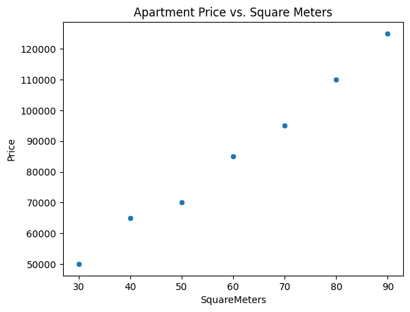
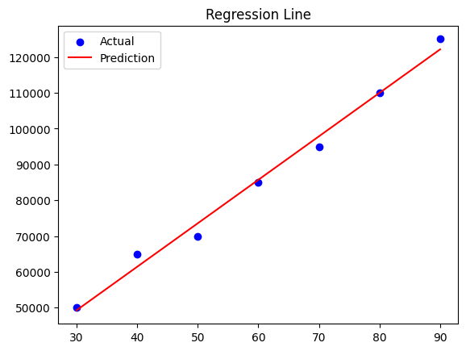
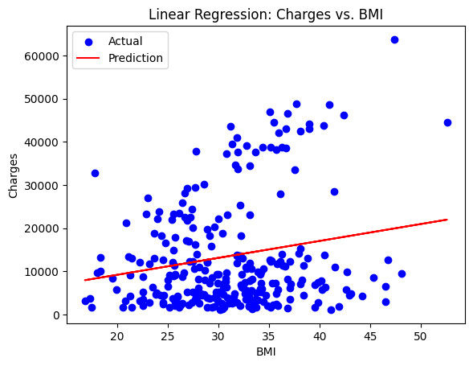
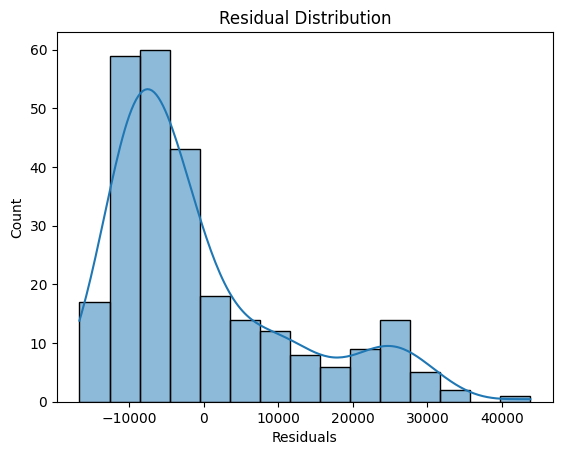
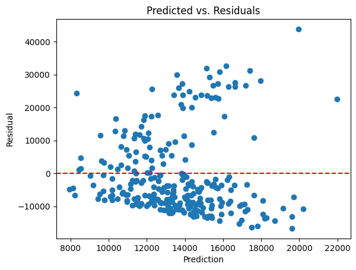

# Linear Regression Analysis in Python

This repository demonstrates how to apply linear regression for analyzing relationships between variables using both synthetic and real-world datasets.







## Features

- Simple linear regression to predict apartment prices based on square footage
- Multiple linear regression using synthetic data (square meters & floor)
- Real-world example: Predicting health insurance charges based on BMI, age, and number of children
- Performance metrics: MAE, MSE, R²
- Residual analysis for model diagnostics

## Libraries Used

- pandas
- matplotlib
- seaborn
- scikit-learn
- kagglehub (for fetching dataset from Kaggle)

## Install dependencies

```bash
pip install pandas matplotlib seaborn scikit-learn kagglehub
